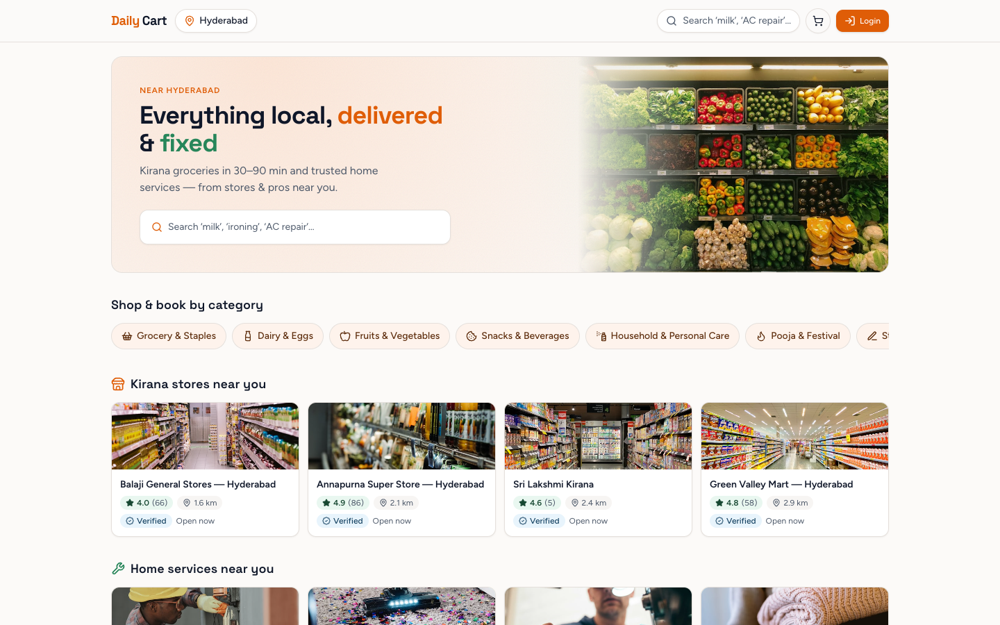
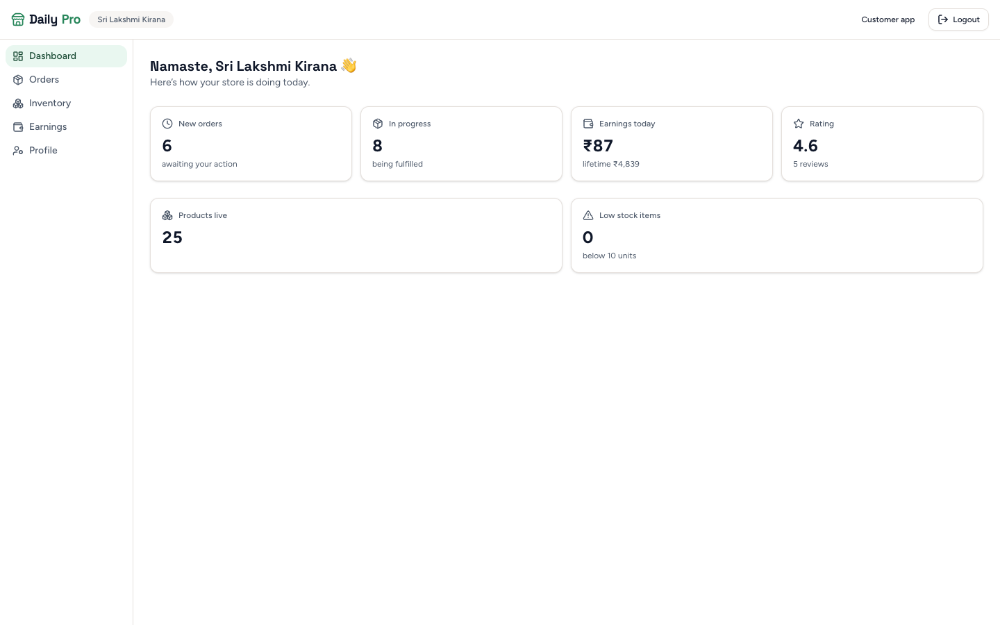
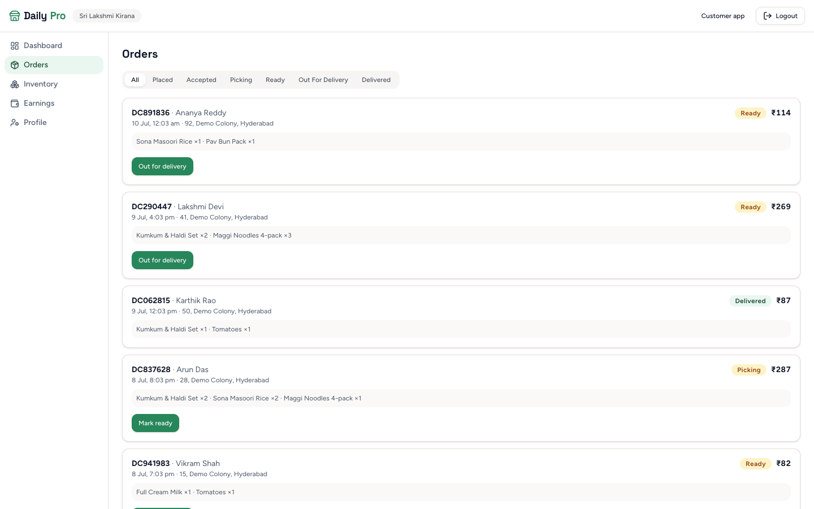
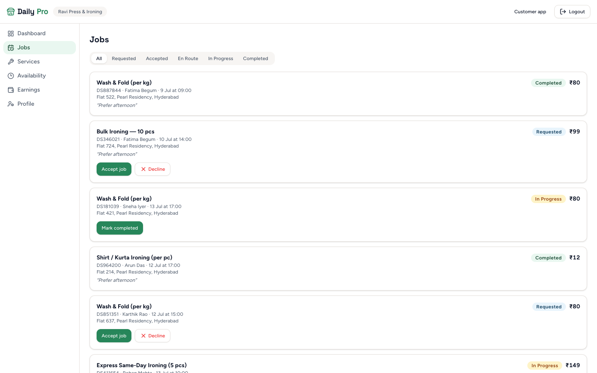
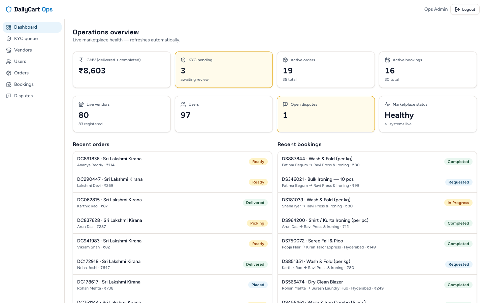
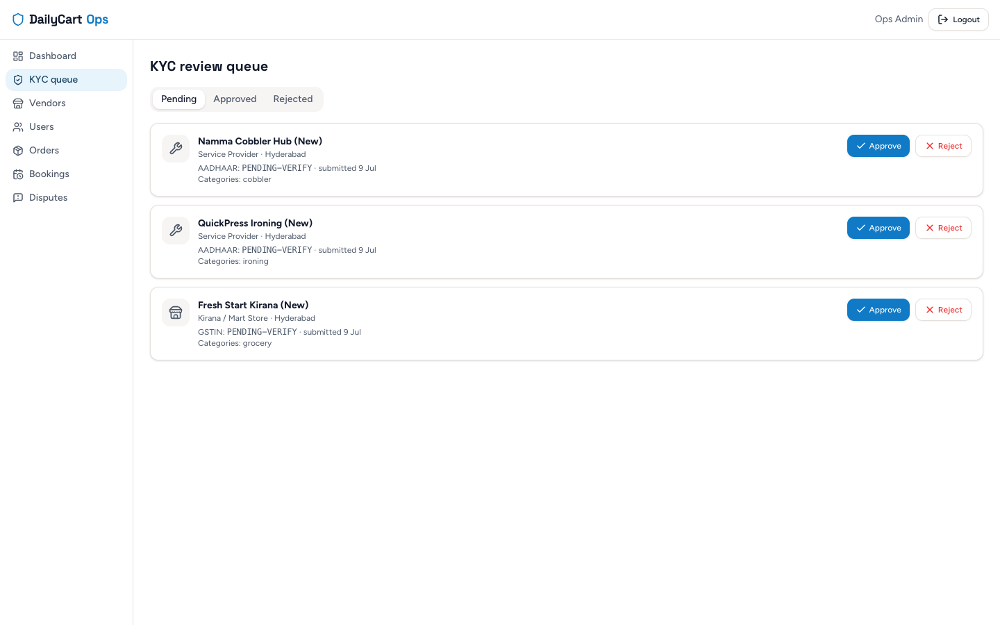
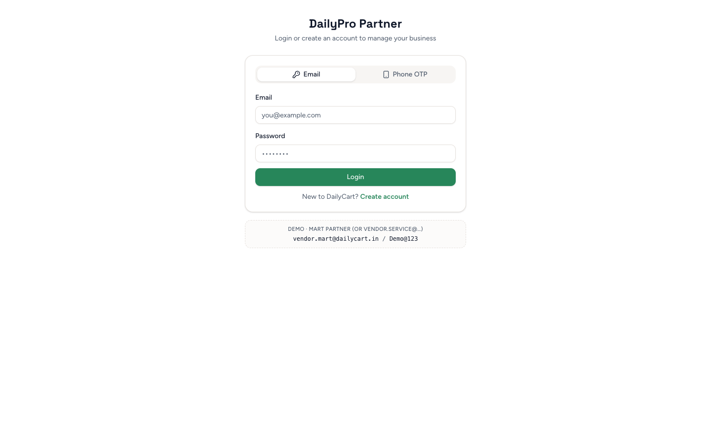
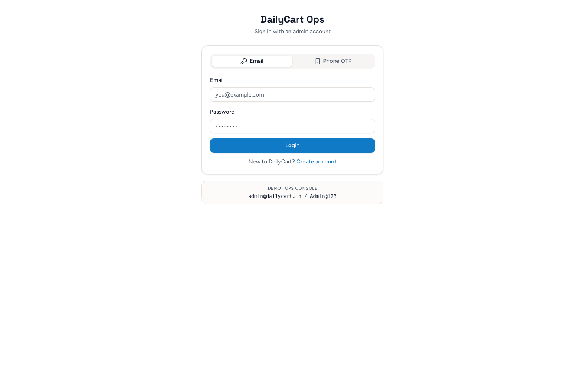

<p align="center">
  
</p>

<h1 align="center">DailyCart</h1>

<p align="center">
  <strong>India-first hyperlocal marketplace</strong> — kirana groceries <em>and</em> neighbourhood services,<br/>
  from ironing & cobbler to AC repair & pandit booking. One product. Three portals.
</p>

<p align="center">
  <a href="#quick-start"></a>
  <a href="#demo-credentials"></a>
  <a href="docs/UAT_READY.md"></a>
  <a href="#license"></a>
</p>

<p align="center">
  <a href="#screenshots">Screenshots</a> ·
  <a href="#why-dailycart">Why</a> ·
  <a href="#architecture">Architecture</a> ·
  <a href="#quick-start">Quick start</a> ·
  <a href="#demo-credentials">Demo logins</a> ·
  <a href="#testing">Testing</a>
</p>

---

## Why DailyCart?

Most demos stop at “plumber + rice”. Real Indian neighbourhoods run on **small, frequent, trust-driven jobs** — presswala, cobbler, tiffin, RO service, mosquito fogging — plus the kirana that also sells pooja items and notebooks.

DailyCart is built for that reality:

| Pillar | What partners see |
|--------|-------------------|
| **DailyMart** | Multi-store cart → N sub-orders · GPS discovery · COD |
| **DailyServe** | Slot booking · ironing → CCTV · status timelines |
| **DailyPro** | Vendor ops — orders/jobs queues, inventory, earnings |
| **Ops** | KYC gate · GMV · disputes · activate/deactivate |

**Seeded demo density (after `seed.py --force`):** 8 cities · 32 stores · 48 pros · ~940 products · ~220 services · live orders/bookings/reviews/disputes.

---

## Screenshots

### Customer — discover nearby


### Vendor DailyPro — live store KPIs


### Vendor — order fulfillment queue


### Service pro — ironing jobs (goldmine vertical)


### Admin Ops — marketplace health


### Admin — KYC queue


<p align="center">
  
  &nbsp;
  
</p>

---

## Features

### Customer
- GPS / city picker — Hyderabad ≠ Pune supply
- Search + autocomplete across products & services
- Multi-vendor cart with **split checkout**
- Order & booking timelines · reviews · disputes
- Email/password + phone OTP (dev mode)

### Vendor (DailyPro)
- Mart: order status machine → delivered
- Service: job queue (e.g. **Ravi Press & Ironing**)
- Inventory / services CRUD · availability · earnings · profile
- KYC pending gate until admin approves

### Admin (Ops)
- Oversight KPIs + GMV
- KYC approve/reject · vendor activate/deactivate
- Orders / bookings oversight · dispute resolution

### Hyperlocal goldmines in seed
Ironing · laundry · cobbler · tailor · tiffin · RO · pest/fogging · gas stove · CCTV · car wash · mini-movers · carpenter · pandit/pooja — plus mart aisles for pooja, stationery, frozen, baby/pet.

---

## Architecture

```text
┌─────────────────┐   ┌──────────────────┐   ┌─────────────────┐
│  Customer  /    │   │  DailyPro /vendor│   │  Ops /admin     │
│  CRA React SPA  │   │  (same SPA)      │   │  (same SPA)     │
└────────┬────────┘   └────────┬─────────┘   └────────┬────────┘
         │                     │                      │
         └─────────────────────┼──────────────────────┘
                               ▼
                    ┌─────────────────────┐
                    │  FastAPI  /api/*    │
                    │  JWT · geo · seed   │
                    └──────────┬──────────┘
                               ▼
                    ┌─────────────────────┐
                    │  MongoDB 2dsphere   │
                    └─────────────────────┘
```

| Layer | Path | Notes |
|-------|------|--------|
| Frontend | `frontend/` | CRA + CRACO, Tailwind, shadcn/ui |
| Backend | `backend/` | FastAPI routers: auth, public, customer, vendor, admin |
| Seed | `backend/seed.py` | India multi-city catalog + activity |
| Docs | `docs/` | UAT report, research notes, screenshots |

---

## Quick start

**Prereqs:** MongoDB on `localhost:27017`, Python 3.11+, Node 18+

```bash
# 1) Backend
cd backend
python3 -m venv .venv && source .venv/bin/activate
# skip emergentintegrations if pip fails — unused in app code
grep -v emergentintegrations requirements.txt | pip install -r /dev/stdin
cp .env.example .env 2>/dev/null || true
# ensure backend/.env has:
#   MONGO_URL=mongodb://localhost:27017
#   DB_NAME=dailycart
#   JWT_SECRET=dailycart-dev-secret-change-me-32b
#   CORS_ORIGINS=http://localhost:3000
python seed.py --force          # fat demo catalog
uvicorn server:app --reload --host 0.0.0.0 --port 8000

# 2) Frontend (new terminal)
cd frontend
echo 'REACT_APP_BACKEND_URL=http://localhost:8000' > .env
npm install --legacy-peer-deps
# if ajv error: npm install ajv@^8 --legacy-peer-deps
npm start
```

| Surface | URL |
|---------|-----|
| Customer | http://localhost:3000/ |
| Vendor | http://localhost:3000/vendor |
| Admin | http://localhost:3000/admin |
| API health | http://localhost:8000/api/health |
| OpenAPI | http://localhost:8000/docs |

---

## Demo credentials

| Role | Email | Password |
|------|-------|----------|
| Customer | `customer@dailycart.in` | `Demo@123` |
| Mart vendor | `vendor.mart@dailycart.in` | `Demo@123` |
| Service (ironing) | `vendor.service@dailycart.in` | `Demo@123` |
| Admin | `admin@dailycart.in` | `Admin@123` |

OTP (dev): send OTP → UI shows `dev_otp`. Customer phone sample: `9999900001`.

**Partner tip:** open Admin first (GMV + KYC), then Mart orders queue, then Ironing jobs — then flip customer city Hyd → Pune.

---

## Testing

```bash
cd backend && source .venv/bin/activate
python ../scripts/uat_e2e_validate.py   # 35 checks — flywheel E2E
python poc_core_flow.py                 # core POC script
```

| Suite | Status |
|-------|--------|
| `scripts/uat_e2e_validate.py` | **35/35 PASS** |
| `backend/poc_core_flow.py` | **POC PASSED** |
| Manual UAT checklist | [`docs/UAT_READY.md`](docs/UAT_READY.md) |

---

## Project layout

```text
DailyCart/
├── frontend/          # React SPA (customer + vendor + admin routes)
├── backend/           # FastAPI + seed + POC
├── scripts/           # uat_e2e_validate.py
├── docs/
│   ├── screenshots/   # README gallery
│   ├── UAT_READY.md
│   └── DEMO_DATA_RESEARCH.md
├── plan.md            # phased delivery status
└── README.md
```

---

## Roadmap (pilot)

- [ ] Real SMS OTP (MSG91 / similar)
- [ ] Razorpay (COD-only today)
- [ ] Production deploy + subdomain portals
- [ ] Playwright CI in-repo

Not blockers for partner demos or UAT.

---

## License

Proprietary — © CodeByte Labs. All rights reserved.

---

<p align="center">
  <sub>Built for Bharat neighbourhoods — kirana mornings, presswala evenings.</sub>
</p>
